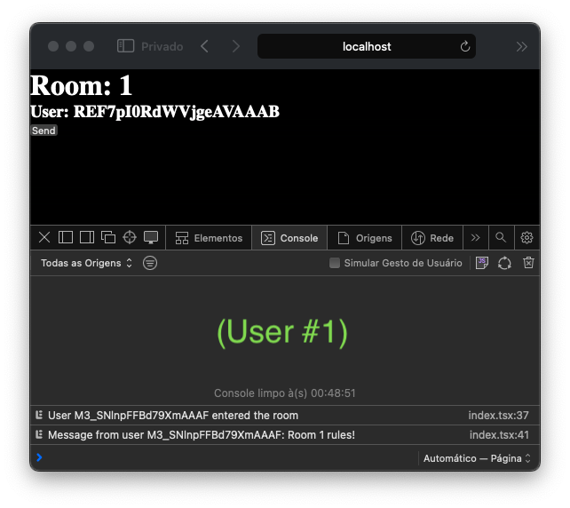
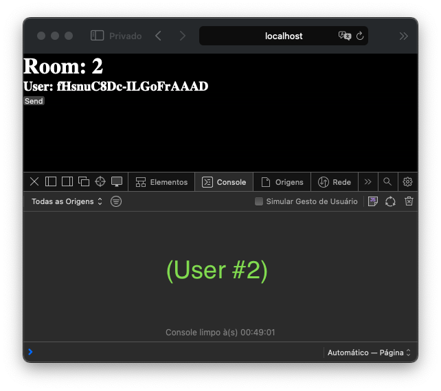
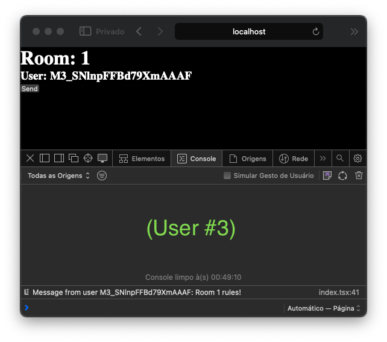
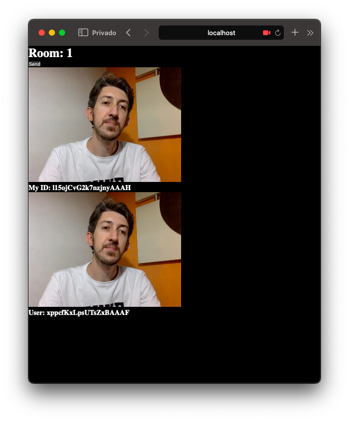
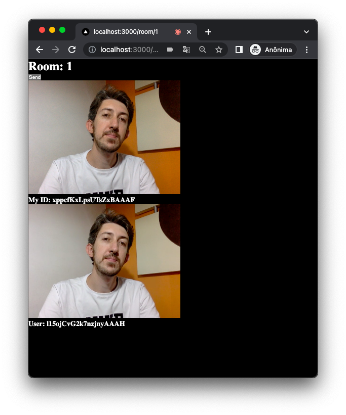

# video-chat-front

## 🚀 Projeto
Um app de video chamadas!

## 🛠️ Tecnologias
- [React](https://pt-br.reactjs.org)
- [simple-peer](https://www.npmjs.com/package/simple-peer) (um wrapper do protocolo WebRTC)
- [socket.io](https://socket.io) (comunicação entre clientes)


## 🧊 Cool features

- Simplicidade</br>
Com poucas linhas de código já conseguimos a estrutura básica de comunicação cliente-servidor, criando e respondendo a eventos de "novo usuário na sala", "nova mensagem", "usuário saiu da sala".
<div align="center">
  
  
  
</div>

- Independência</br>
Usando o protocolo [WebRTC](https://developer.mozilla.org/pt-BR/docs/Web/API/WebRTC_API) podemos passar dados de audio e vídeo direto para outros dispositivos em uma conexão P2P, sem depender de plugins de empresas terceiras que cobram por esse serviço. A comunicação é feita diretamente entre os clientes, e o servidor só é necessário para montar a sala e estabelecer as conexões.
<div align="center">
  
  
</div>

## 🗂️ Utilização

### 🐑🐑 Clonando o repositório:

```bash
  $ git clone url-do-projeto.git
```

### ▶️ Rodando o App:
- Terminal 1: Back</br>
Seguir as instruções [desse repositório](https://github.com/Alessandro1918/video-chat-back)

- Terminal 2: Front
```bash
  $ cd video-chat-front
  $ npm install             #download dependencies to node_modules
  $ npm run dev             #start the project
```

- Acessar a página do chat em:
```
  http://localhost:3000/room/ENTER_YOUR_UNIQUE_ROOM_ID_HERE
```